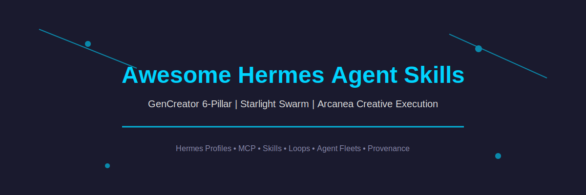
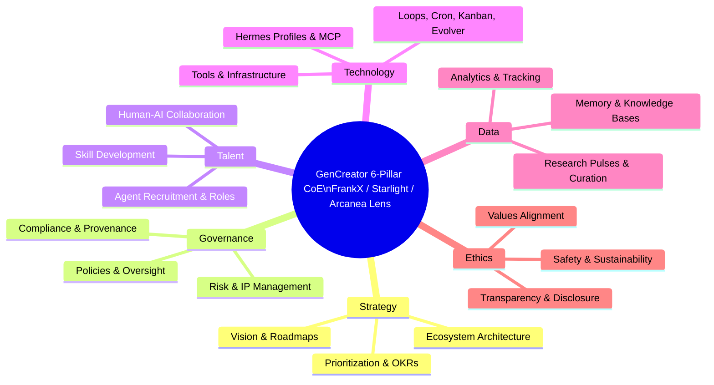

  

<h1 align="center">Awesome Hermes Agent Skills</h1>

  <strong>THE definitive curated list of Hermes Agent skills, profiles, MCP servers, loops, cron, kanban, evolver, and provenance templates | GenCreator 6-Pillar CoE • Starlight Swarm • Arcanea Creative Execution • Agentic Passive Income Systems</strong>

  <a href="#top-picks">Top Picks</a> ·
  <a href="#6-pillar-mapping">6-Pillar Mapping</a> ·
  <a href="#contents">Contents</a> ·
  <a href="#explore-the-full-frankx-awesome-ecosystem-17-lists">Full Ecosystem</a> ·
  <a href="CONTRIBUTING.md">Contribute</a>

> Curated through the GenCreator 6-Pillar CoE lens. The operating layer for sovereign, local-first Hermes fleets with skills as portable SKILL.md, provenance, and self-improving loops.

## Why This List Exists

Hermes Agent is the runtime; skills are the portable intelligence. This list is the canonical index for all skills, profiles, MCP integrations, and the loops that make fleets autonomous. It fills the gap between generic agent lists and production-grade, 6-Pillar-governed Hermes deployments with income and governance angles.

Cross-references gstack skills, agentic-passive-income, and lol-esports-llm-agents for gamification.

## Contents

- [Top Picks](#top-picks)
- [Core Hermes Skills & Profiles](#core-hermes-skills--profiles)
- [MCP & Tool Protocols](#mcp--tool-protocols)
- [Loops, Cron, Kanban, Evolver](#loops-cron-kanban-evolver)
- [6-Pillar Mapping](#6-pillar-mapping)
- [Explore the Full FrankX Awesome Ecosystem (17+ Lists)](#explore-the-full-frankx-awesome-ecosystem-17-lists)
- [Contribution & Provenance](#contribution--provenance)

## Top Picks

| Name | Description | Stars | Link | 6-Pillar Fit |
|------|-------------|-------|------|--------------|
| hermes-agent | Core Nous Hermes Agent runtime with profiles and tools | 45 | https://github.com/NousResearch/hermes-agent | Technology, Governance |
| agentic-passive-income | Income loops and compounding systems | 12 | https://github.com/frankxai/agentic-passive-income | Strategy, Data, Ethics |
| gencreator-swarm-evolver | Continuous evolution and test loops | 7 | https://github.com/frankxai/gencreator-swarm-evolver | Technology, Talent |
| lol-esports-llm-agents | Gamification patterns for wealth | 3 | https://github.com/frankxai/lol-esports-llm-agents | Strategy, Talent |

## Core Hermes Skills & Profiles

- [hermes-agent-skill-authoring](https://github.com/frankxai/hermes-agent-skill-authoring) - Author in-repo SKILL.md with frontmatter and validator
- Skills from gstack: gstack-*, eve, plus local .agents/skills
- [awesome-hermes-agents](https://github.com/frankxai/awesome-hermes-agents) - Reference for Hermes fleets

## MCP & Tool Protocols

- MCP servers for Hermes
- Tool harness adapters
- Provenance-and-naming.md integration

## Loops, Cron, Kanban, Evolver

- Kanban-orchestrator and kanban-worker
- experiment-orchestration
- gencreator-swarm-evolver

## 6-Pillar Mapping

## Explore the Full FrankX Awesome Ecosystem (17+ Lists)

Curated through the GenCreator 6-Pillar CoE lens • Starlight Swarm • Arcanea Creative Execution • Agentic Passive Income Systems

- [awesome-jarvis](https://github.com/frankxai/awesome-jarvis) (private - Jarvis meta-orchestrator)
- [awesome-manifestation-skills](https://github.com/frankxai/awesome-manifestation-skills)
- [awesome-agentic-income](https://github.com/frankxai/awesome-agentic-income)
- [awesome-hermes-agents](https://github.com/frankxai/awesome-hermes-agents)
- [awesome-ai-coe](https://github.com/frankxai/awesome-ai-coe)
- [awesome-design-agent-skills](https://github.com/frankxai/awesome-design-agent-skills)
- [awesome-music-agent-skills](https://github.com/frankxai/awesome-music-agent-skills)
- [awesome-agent-operating-systems](https://github.com/frankxai/awesome-agent-operating-systems) (reference pattern with hero, validate, docs/)
- [awesome-hermes-agent-skills](https://github.com/frankxai/awesome-hermes-agent-skills)
- [awesome-wealth-agent-skills](https://github.com/frankxai/awesome-wealth-agent-skills)
- [awesome-gamification-agent-skills](https://github.com/frankxai/awesome-gamification-agent-skills)
- [awesome-investor-agent-skills](https://github.com/frankxai/awesome-investor-agent-skills)
- [awesome-automation-agent-skills](https://github.com/frankxai/awesome-automation-agent-skills)
- [awesome-cosmos-ai-agents](https://github.com/frankxai/awesome-cosmos-ai-agents)
- [awesome-mind-agent-skills](https://github.com/frankxai/awesome-mind-agent-skills)
- [awesome-payment-agent-skills](https://github.com/frankxai/awesome-payment-agent-skills)
- [awesome-motion-design-agent-skills](https://github.com/frankxai/awesome-motion-design-agent-skills)

**Additional discovered**: awesome-suno-agent-skills, gstack skills, lol-esports-llm-agents for gamification/wealth.

## Contribution & Provenance

See CONTRIBUTING.md and provenance-and-naming.md from awesome-hermes-agents.

Maintained via awesome-list-maintenance skill + gencreator-swarm-evolver. Last research pulse: 2026-07-01

Updated with mermaid 6-pillar, 17-list cross links, hero visual, .github templates.
