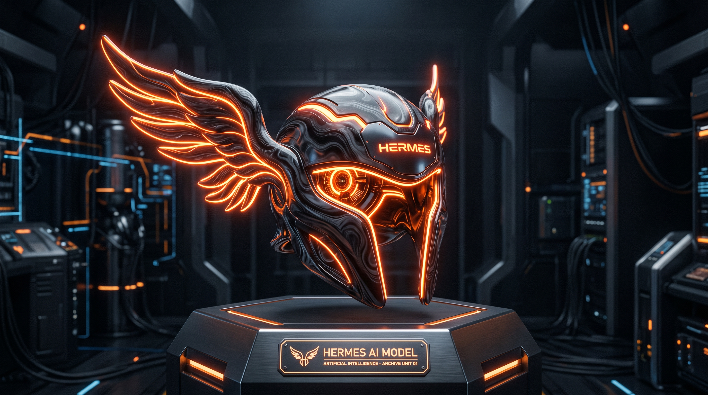

<p align="center">
  
</p>

<h1 align="center">Awesome Hermes Agent Skills</h1>

<p align="center">
  <strong>A curated list of the best Hermes-compatible skills, plugins, and skill factories from across the web — plus a few free open-core packs we maintain.</strong>
</p>

<p align="center">
  <a href="https://awesome.re"></a>
  <a href="https://github.com/frankxai/awesome-hermes-agent-skills/actions/workflows/link-checker.yml"></a>
  <a href="LICENSE"></a>
</p>

---

> Independent curation. **Not** official Nous Research.  
> Official skill docs: [Skills](https://hermes-agent.nousresearch.com/docs/user-guide/features/skills) · [Creating skills](https://hermes-agent.nousresearch.com/docs/developer-guide/creating-skills) · [agentskills.io](https://agentskills.io)

**This is an awesome list of the web**, not a marketing page for our packs.  
FrankX free packs are listed last under [Maintained in this repo](#maintained-in-this-repo-optional).

| Companion | Role |
| --- | --- |
| [awesome-hermes-agents](https://github.com/frankxai/awesome-hermes-agents) | Agents, UIs, memory, deploy, multi-agent, operator docs |
| **This repo** | Skills / plugins / skill factories (web-wide) |

Also see:

- [0xNyk/awesome-hermes-agent](https://github.com/0xNyk/awesome-hermes-agent)  
- [SamurAIGPT/awesome-hermes-agent](https://github.com/SamurAIGPT/awesome-hermes-agent)  

Maturity labels: **production** · **beta** · **experimental**  
Research pulse: **2026-07-16**

---

## Contents

- [How to install a skill](#how-to-install-a-skill)
- [Skill libraries & standards](#skill-libraries--standards)
- [Hermes-native skills & plugins](#hermes-native-skills--plugins)
- [agentskills.io & cross-harness packs](#agentskillsio--cross-harness-packs)
- [Domain skill packs](#domain-skill-packs)
- [Skill factories & evolution](#skill-factories--evolution)
- [Related tools (skills-adjacent)](#related-tools-skills-adjacent)
- [Maintained in this repo (optional)](#maintained-in-this-repo-optional)
- [Skill Portfolio OS](#skill-portfolio-os)
- [Contributing](#contributing)

---

## How to install a skill

1. Install Hermes: [official installation](https://hermes-agent.nousresearch.com/docs/getting-started/installation)  
2. Clone or copy a skill folder containing `SKILL.md` into your Hermes skills directory  
   - Windows: often `%LOCALAPPDATA%\hermes\skills\`  
   - macOS/Linux: often `~/.hermes/skills/`  
   - Profile-scoped skills may live under the profile home  
3. New session / reload skills; invoke by skill name  

Prefer the project's own README for exact install (`hermes skills install …`, `npx skills add …`, etc.).

---

## Skill libraries & standards

| Project | Maturity | Why |
| --- | --- | --- |
| [agentskills.io](https://agentskills.io) | production | Open skill standard used by Hermes + many harnesses |
| [wondelai/skills](https://github.com/wondelai/skills) | production | Large multi-harness skills library (~1.6k★) — great first install |
| [0xNyk/awesome-hermes-agent](https://github.com/0xNyk/awesome-hermes-agent) | production | Independent directory of skills/plugins/tools |
| [SamurAIGPT/awesome-hermes-agent](https://github.com/SamurAIGPT/awesome-hermes-agent) | production | Hand-picked list with maturity tags |
| [NousResearch/hermes-agent](https://github.com/NousResearch/hermes-agent) skills docs | production | Built-in skill system + curator loop |

---

## Hermes-native skills & plugins

| Project | Maturity | Why |
| --- | --- | --- |
| [42-evey/hermes-plugins](https://github.com/42-evey/hermes-plugins) | beta | Goals, inter-agent bridge, model selection, cost control |
| [Romanescu11/hermes-skill-factory](https://github.com/Romanescu11/hermes-skill-factory) | beta | Auto-generate skills from real workflows |
| [tlehman/litprog-skill](https://github.com/tlehman/litprog-skill) | beta | Literate programming for Hermes / Claude Code / OpenCode |
| [Cranot/super-hermes](https://github.com/Cranot/super-hermes) | experimental | Teach Hermes to write stronger analytical prompts first |
| [witt3rd/oh-my-hermes](https://github.com/witt3rd/oh-my-hermes) | beta | Orchestration skills: deep-research, ralplan, ralph, triage, autopilot |
| [markoblogo/abvx-agent-skills](https://github.com/markoblogo/abvx-agent-skills) | production | Auditable coding skillpack (diffs, evidence, review) |
| [Lethe044/hermes-incident-commander](https://github.com/Lethe044/hermes-incident-commander) | beta | SRE detect / heal / learn on Hermes primitives |
| [Lethe044/hermes-life-os](https://github.com/Lethe044/hermes-life-os) | experimental | Personal OS + memory + cron patterns |
| [Yonkoo11/hermes-dojo](https://github.com/Yonkoo11/hermes-dojo) | beta | Monitor weak skills → self-evolve → report |
| [Hmbown/Wizards-of-the-Ghosts](https://github.com/Hmbown/Wizards-of-the-Ghosts) | experimental | Fantasy-themed dev ops skill pack |
| [Alexeyisme/hermes-spotify-skill](https://github.com/Alexeyisme/hermes-spotify-skill) | beta | Headless Linux / Pi Spotify control |
| [adnw-vinc/hermes-nextcloud](https://github.com/adnw-vinc/hermes-nextcloud) | beta | Nextcloud files / notes / cal / contacts bridge |
| [Lethe044/hermes-skill-marketplace](https://github.com/Lethe044/hermes-skill-marketplace) | experimental | Agent writes/tests/publishes skills |
| [beiyuii/personal-api-skill](https://github.com/beiyuii/personal-api-skill) | experimental | Obsidian vault → identity layer for agents |
| [Andrew-Girgis/microsoft-workspace-skill](https://github.com/Andrew-Girgis/microsoft-workspace-skill) | beta | Outlook / M365 Graph email+calendar skill |
| [Rainhoole/hermes-agent-acp-skill](https://github.com/Rainhoole/hermes-agent-acp-skill) | beta | Multi-agent delegation Hermes ↔ Codex ↔ Claude Code |

---

## agentskills.io & cross-harness packs

These install on Hermes **and** often Claude Code / Cursor / OpenClaw / Codex.

| Project | Maturity | Why |
| --- | --- | --- |
| [mukul975/Anthropic-Cybersecurity-Skills](https://github.com/mukul975/Anthropic-Cybersecurity-Skills) | production | 750+ MITRE-mapped security skills |
| [black-forest-labs/skills](https://github.com/black-forest-labs/skills) | production | Official FLUX image generation skills |
| [smartcontractkit/chainlink-agent-skills](https://github.com/smartcontractkit/chainlink-agent-skills) | production | Official Chainlink oracle / CCIP skills |
| [Agents365-ai/drawio-skill](https://github.com/Agents365-ai/drawio-skill) | production | draw.io from natural language |
| [ZeroPointRepo/youtube-skills](https://github.com/ZeroPointRepo/youtube-skills) | production | YouTube search + robust transcripts |
| [Infrasity-Labs/dev-gtm-claude-skills](https://github.com/Infrasity-Labs/dev-gtm-claude-skills) | production | SEO / GEO / developer marketing skills |
| [CorpusIQ/corpusiq-docs](https://github.com/CorpusIQ/corpusiq-docs) | production | Business ops + many SaaS connectors via MCP |
| [longbridge/skills](https://github.com/longbridge/skills) | production | Markets / portfolio skills (multi-region) |
| [DougTrajano/pydantic-ai-skills](https://github.com/DougTrajano/pydantic-ai-skills) | production | Type-safe Pydantic AI + agentskills.io |
| [nexu-io/open-design](https://github.com/nexu-io/open-design) | production | Design system + media skills; Hermes via ACP |
| [Yarmoluk/cognify-skills](https://github.com/Yarmoluk/cognify-skills) | beta | CRM / invoicing / PM business ops |
| [tiann/execplan-skill](https://github.com/tiann/execplan-skill) | beta | Long-running task lifecycle / checkpoints |
| [ReinaMacCredy/maestro](https://github.com/ReinaMacCredy/maestro) | beta | Skill orchestration with planning + tracking |
| [armelhbobdad/bmad-module-skill-forge](https://github.com/armelhbobdad/bmad-module-skill-forge) | beta | Convert repos/docs into skills |
| [cablate/Agentic-MCP-Skill](https://github.com/cablate/Agentic-MCP-Skill) | beta | MCP client + agentskills validation |
| [Merit-Systems/agentcash-skills](https://github.com/Merit-Systems/agentcash-skills) | beta | Wallet-backed access to 300+ APIs |
| [Xquik-dev/x-twitter-scraper](https://github.com/Xquik-dev/x-twitter-scraper) | beta | Large X/Twitter skill surface |
| [voidborne-d/master-skill](https://github.com/voidborne-d/master-skill) | beta | Distill an industry domain into a portable skill |
| [remoet-labs/agent-skills](https://github.com/remoet-labs/agent-skills) | production | Job search by tech stack + MCP |
| [Sequenzy/skills](https://github.com/Sequenzy/skills) | beta | Email marketing lifecycle skills |
| [resemble-ai/detect-skill](https://github.com/resemble-ai/detect-skill) | beta | Deepfake / media authenticity for agents |

---

## Domain skill packs

| Project | Domain |
| --- | --- |
| [svenmedina07-ship-it/skills (acca-tracker)](https://github.com/svenmedina07-ship-it/skills/tree/main/acca-tracker) | Sports accumulator tracking |
| [setasoma/mycodo-hermes-skill](https://github.com/setasoma/mycodo-hermes-skill) | IoT mushroom cultivation |
| [bbolinger/snapmaker-u1-toolkit](https://github.com/bbolinger/snapmaker-u1-toolkit) | 3D printer automation |
| [currentslab/news-api-skills](https://github.com/currentslab/news-api-skills) | News search/read skills |
| [internet-court/internet-court-skill](https://github.com/internet-court/internet-court-skill) | Agent commerce / escrow patterns |
| [longsizhuo/openInvest](https://github.com/longsizhuo/openInvest) | Investment research (not advice) |
| [avansaber/erpclaw](https://github.com/avansaber/erpclaw) | ERP + agent action layer |
| [wordbricks skills / onequery-cli](https://github.com/wordbricks/skills/tree/main/skills/onequery-cli) | Governed read-only SQL for agents |

---

## Skill factories & evolution

| Project | Why |
| --- | --- |
| Built-in Hermes skill creation + curator | Official closed loop — see [skills docs](https://hermes-agent.nousresearch.com/docs/user-guide/features/skills) |
| [Romanescu11/hermes-skill-factory](https://github.com/Romanescu11/hermes-skill-factory) | Turn sessions into reusable skills |
| [AMAP-ML/SkillClaw](https://github.com/AMAP-ML/SkillClaw) | Evolve/dedupe libraries from session data; native Hermes paths |
| [NousResearch/hermes-agent-self-evolution](https://github.com/NousResearch/hermes-agent-self-evolution) | Research: DSPy + GEPA evolution |
| [Yonkoo11/hermes-dojo](https://github.com/Yonkoo11/hermes-dojo) | Find weak skills and improve them |
| [Lethe044/hermes-skill-marketplace](https://github.com/Lethe044/hermes-skill-marketplace) | Publish pipeline experiments |

---

## Related tools (skills-adjacent)

Not pure `SKILL.md` packs, but skill operators use them constantly:

| Project | Role |
| --- | --- |
| [outsourc-e/hermes-workspace](https://github.com/outsourc-e/hermes-workspace) | GUI with skills manager |
| [builderz-labs/mission-control](https://github.com/builderz-labs/mission-control) | Fleet dispatch + cost |
| [luoyuctl/agenttrace](https://github.com/luoyuctl/agenttrace) | Session audit skill companion |
| [fkiene/llmtrim](https://github.com/fkiene/llmtrim) | Trim tool schemas before model calls |
| [awesome-hermes-agents](https://github.com/frankxai/awesome-hermes-agents) | Full agents/UI/deploy list |

---

## Maintained in this repo (optional)

Small **open-core** packs we ship for free. These are **not** “the list” — the list above is the list.

| Pack | Description | Path |
| --- | --- | --- |
| **coding-agents-superpack** | Multi-CLI discovery, structured prompts, council handoffs (sanitized) | [`skills/coding-agents-superpack`](./skills/coding-agents-superpack/SKILL.md) |
| **todo-discipline** | Task list must match reality before “done” | [`skills/todo-discipline`](./skills/todo-discipline/SKILL.md) |

```bash
git clone https://github.com/frankxai/awesome-hermes-agent-skills.git
cp -R awesome-hermes-agent-skills/skills/todo-discipline ~/.hermes/skills/
```

**Rule:** stranger can run it with no private secrets → free. Brand/production CoE kits stay gated elsewhere.

---

## Skill Portfolio OS

How we classify free vs gated vs product (ops for maintainers of *this* tree):

→ [`docs/skill-portfolio-os/`](./docs/skill-portfolio-os/)

Especially: [CLASSIFICATION.md](./docs/skill-portfolio-os/CLASSIFICATION.md) · [PUBLISH-PLAYBOOK.md](./docs/skill-portfolio-os/PUBLISH-PLAYBOOK.md) · [STORAGE-TAXONOMY.md](./docs/skill-portfolio-os/STORAGE-TAXONOMY.md)

---

## Contributing

- Add **web** skills with: link, one-line why, maturity, and that it actually has a `SKILL.md` / install path.  
- Prefer PRs that improve discovery of **others'** work.  
- Own packs must stay secret-free and portable.  
- Agent/UI/deploy entries → [awesome-hermes-agents](https://github.com/frankxai/awesome-hermes-agents).  
- See [CONTRIBUTING.md](./CONTRIBUTING.md) · [GETTING_STARTED.md](./GETTING_STARTED.md)

---

## License

[MIT](./LICENSE)

---

<p align="center">
  <sub>Curated by <a href="https://github.com/frankxai">frankxai</a>
  · Ecosystem also: <a href="https://github.com/0xNyk/awesome-hermes-agent">0xNyk</a> · <a href="https://github.com/SamurAIGPT/awesome-hermes-agent">SamurAIGPT</a>
  · Agents companion: <a href="https://github.com/frankxai/awesome-hermes-agents">awesome-hermes-agents</a>
  · Pulse: <strong>2026-07-16</strong></sub>
</p>
